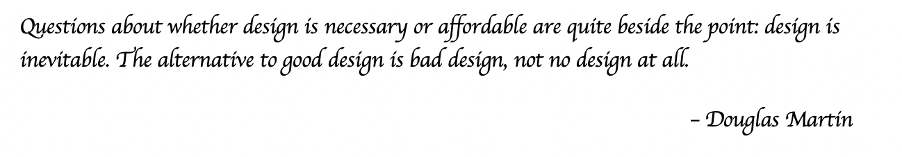

# Domain Driven Design
   
  

  Take a look around you. That park was carefully designed before it was built, and so was every road, every street and even this city. There is a lot of thought given while planning and designing automotives, aircrafts, bridges and buildings. Why not design software? If you think software design is expensive, fixing a bad design or even living with one is even more expensive.

  Given below are some of the problems that can be encountered as a result of not giving much thought to design:

  1. Software Development 

## What is Domain Driven Design?

###  How does Domain Driven Design fit with Agile?

## Domain Driven Design Terminology 

## Monoliths vs Microservices

## Reactive vs Declarative Systems

## Event Driven Architecture