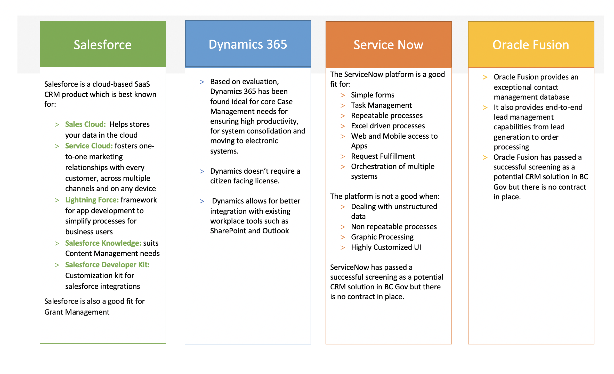

# Customer Relationship Management

**Archetype: Customer Relationship Management**

## Patterns  

Customer relationship management (CRM) is the management of an organization's interaction with current and potential customers. Customers in a public sector context include citizens, businesses, and other stakeholders. Some defining features of a CRM include a centralized contact list and correspondence tracking. A CRM may include workflow capabilities, analytical features to measure customer satisfaction, lead potential, and integrations with call centre applications, and other communication systems such as email. 
 
## Anti-Patterns:

We must distinguish between the need for a CRM solution, and building other systems upon a platform that is (or was) at its core, a CRM system, simply because they are related systems.  Although "case management" might be (arguably) seen by some as a derivative of CRM, for this exercise, one is not the other.  A "CRM platform" is not necessarily CRM, though it does enable CRM capabilities. 

## Qualified CRM platforms

### Examples: 

Out-of-the-box Microsoft Dynamics could be classified as a CRM system, as could SalesForce.  However, given the risk and associated cost, of building dependencies upon a platform such as (SalesForce) force.com or upon Dynamics (the PaaS), for this exercise, we must differentiate between them.  

### Preferred Direction: 

Distinguish CRM from the platforms upon which they’re built.  Determine guidelines for the use of both, and provide advisory services for implementation of both.  Guard against the accidental overlap – build upon a CRM platform must be an explicit and fully-informed decision, to guard against vendor product and service lock-in, and to optimize exit costs. 

For discussion: Should "lower-level" capabilities like the ones mentioned above (mail, analytics, workflow) be in this list, or a separate list, or neither?

### CRM Procurement 

In 2018 the Province of BC submitted a Request of Qualification (RFQ 060518 CUSTOMER RELATIONSHIP MANAGEMENT (“CRM”) PLATFORM) to build a pre-qualified list of vendors for cloud CRM platform vendors that are able to seamlessly manage the diverse set of government-to-citizen, or government-to-organization, interactions that comprise the “citizen lifecycle” leveraging multi-channel delivery to support integrated service delivery, both internal and external to government.

Applicants are screened by the Province on technical, security, and privacy requirements outlined in RFQ Questionnaire. The RFQ does not include implementation or other related professional services or subscription resellers.

The RFQ is open for 5 years leading to four successful applicants:

Salesforce:

• Contract in place for core government 

• PIA and STRA for PII

Microsoft Dynamics 365

• Contract in place for core government 

• PIA and STRA for Non-PII

ServiceNow

• Successful Screening 
• No Contract, PIA, or STRA

Oracle Fusion

• Successful Screening 
• No Contract, PIA, or STRA

### CRM Adoption

Salesforce

• Process tested: SDPR, MHA, OCIO, AVED, Justice, LRB, Employment Standards Tribunal, Employment Standards Board, Employment and Assistance Appeal Tribunal, TAC, Civil Forfeiture Office, CFD, JTT, Civil Resolution Tribunal

Microsoft Dynamics 365

• Process tested: AVED, AG, CITZ, Education, SDPR, BC Emergency Health Services

ServiceNow

• Awaiting first initiative

Oracle Fusion

• Awaiting first initiative

## Other CRM options

### Opensource CRM

#### HubSpot CRM

HubSpot CRM was started in 2004 and provides tools that can be used by small to large enterprises. HubSpot CRM provides free marketing, sales, customer service, and contact management tools.

##### Features

    ✓ Contact management                 ✓ Ad management
    ✓ Contact website activity           ✓ Conversations inbox
    ✓ Companies                          ✓ Reporting dashboard
    ✓ Deals                              ✓ Email tracking & notifications
    ✓ Tasks & activities                 ✓ Email templates
    ✓ Company insights                   ✓ Canned snippets
    ✓ Gmail and Outlook integration      ✓ Canned snippets
    ✓ App Marketplace integrations       ✓ Documents
    ✓ Custom support form fields         ✓ Calling
    ✓ Prospects                          ✓ Meeting scheduling
    ✓ Ticketing                          ✓ Messenger integration
    ✓ Forms                              ✓ Custom properties

##### Pros

    ✓ Unlimited number of users                        ✓ Unlimited Contacts
    ✓ 1,000,000 contacts                               ✓ SaaS solution 
    ✓ No additional hardware costs                     ✓ All CRM functionality available for free
    ✓ Can be integrated with additional
      sales and marketing tools for free

##### Cons

    ✕ Limited syncing between contact and deal data    ✕ Weak search function
    ✕ Inability to log email attachments to contact    ✕ Large range of features, but lack depth
      records

### Serverless Options

## Implementation Approaches
## On Prem
 
One of the options for implementing a CRM solution is building a custom one.
 
### Pros
 
  1. Ability to customize and build features that are essential to your organization
  2. Complete control on your systems and data
 
### Cons
 
  1. You need to set up an agile team to iteratively develop and manage the custom build solution
  2. The time and cost taken to custom build a CRM solution are on the higher side
  3. You might end up reinventing the wheel
 

### Cloud
 
  According to a study by IBM, 88% of CRM solutions were on premise and custom build in 2008 whereas 87% are cloud based today. By choosing to move towards a Cloud CRM or SaaS solution, you are relieved off installing, configuring and maintaining your own servers and infrastructure for the CRM solution. You only pay for the licenses per the number of users.
 
### Pros
 
1. Lower upfront cost
 2. The installation, maintenance, upgrades, back-ups, integration and resolution of technical issues are all managed by the vendor.
3. Quicker deployment process.
4. Flexibility of payment – you can increase or decrease subscriptions as and when required.
 
### Cons
 
1. Possible vendor lock-in
 

### On Prem vs SaaS cost comparison
 
####### Work in Progress ########
  
**Comparing the costs and other factors, we recommend the usage of ____________  as the best CRM solution for BC government use.**

## Total cost of ownership

### Small

### Medium

### Large

## Product plays​

### Engaging product owner​

### Selecting the platform​

### Selecting the team​

## Service expectations

### Ministry responsibilities​

### OCIO responsibilities​

### Communities of Practice​

