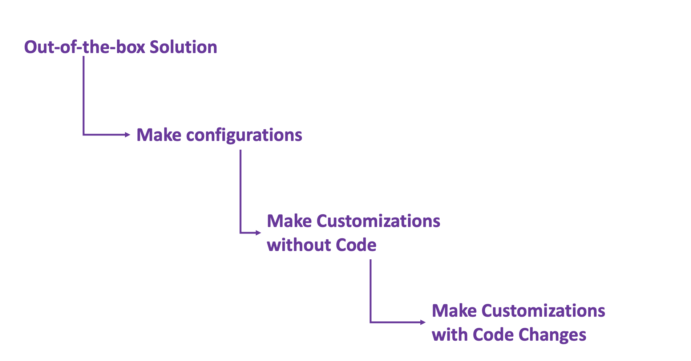

# Customizations
<!--- {: .no_toc }

## Table of contents
{: .no_toc .text-delta }

1. TOC
{:toc}
-->

## Considerations before making a change

 It is recommended to use the following approach while adopting a CRM solution:

 1. **Use out-of-the-box functionality**: In most cases, you will be able to find what you need by using the functionality that is available by default in the CRM solution you bought.

 2. **Make configurations**: More often than not, as you business grows, so does your CRM. You will find to tweak your objects such as increasing the size of your fields. This can be achieved by making configuration changes to objects.

 3. **Make Customizations without Code**: Configuration changes do not permit you to add new objects such as new fields, new menu options or new screens. In these circumstances you will need to create new objects, but this can be done without writing code and by using in built designer tools. 

 4. **Developing new code**: In most of the cases, customizations will not require you to write code. However more complex scenarios such as integrations with 3rd party application will require you to write code to make changes to the way the CRM solution works. This is **least recommended** scenario.

Also Read:
 
[Customizations: Dynamics vs Salesforce](CRM-CustomizationsDynamicsvsSalesforce.html)
 
[Development Life Cycle in Salesforce](CRM-DevelopmentLifeCycleSalesforce.html)
 
[Development Life Cycle in Microsoft Dynamics](CRM-DevelopmentLifeCycleDynamics.html)
