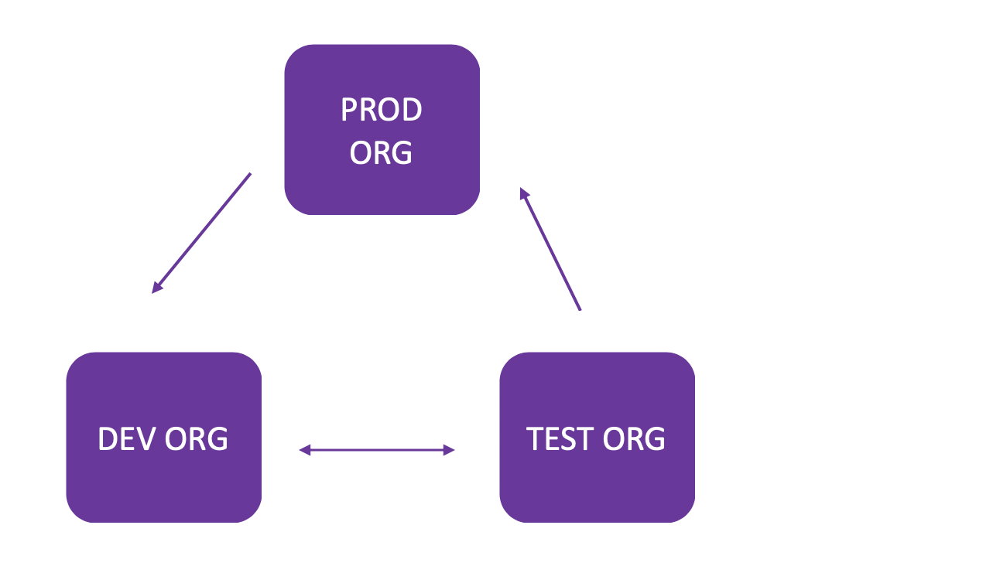

# Development Life Cycle in Salesforce
<!---{: .no_toc }

## Table of contents
{: .no_toc .text-delta }

1. TOC
{:toc} -->

## Customizing the Salesforce Platform

Building a new functionality could refer to:

  - customizing existing Salesforce offerings
  - building an app from scratch

The **Salesforce core platform** lets you develop custom data models and applications for desktop and mobile.

**Heroku** empowers developers  to build highly scalable web apps and back-end services using Python, Ruby, Go. It also provides database tools to sync seamlessly with data from Salesforce.

**Salesforce APIs** help developers integrate and connect enterprise data, networks, and identity information.

**Mobile SDK** is a suite of technologies that enables you to build native, HTML5, and hybrid apps that have the same reliability and security as the Salesforce app.

Developing features on Salesforce can be broadly classified into:

**Declarative Development** : 

Declarative development allows you to develop custom objects and functions specific to your business  without writing a single line of code. You can use forms and drag-and-drop tools to build these custom features.

For example, if you want to add a new custom field, lightning components allows you to do this by using the Object Manager, which has a wide variety of predefined field types to choose from and equips you with a point-and-click development tool kit.

In Salesforce, metadata forms the structure of your instance. It holds configuration such as fields and business processes. If you are developing on the Salesforce platform, it is aware of your metadata and can autogenerate dialogs, record lists, detail views, and forms. It also allows to create, read, update, and delete custom object records in the database.

Some development tasks, like writing validation rules or hooking up components with UI elements, require some basic programmatic knowledge to complete but can be done using the Process Builder by building flow charts.

To summarize, object builder, schema builder and process builder help you develop features without writing code.

**Programmatic Development** : 

Programmatic Development allows you add further extensions, integrations and enhance the functionality of of your CRM.

When there is need to add additional functionality, there are three core programmatic technologies in Salesforce:

 1. **Lightning Component Framework**: A UI development framework similar to AngularJS or React. The Lightning component framework can be used when you want to build a custom user interface. 
 2. **Apex**: Salesforce’s proprietary programming language with Java-like syntax.
 3. **Visualforce**: A markup language that lets you create custom Salesforce pages with code that looks a lot like HTML, and optionally can use a powerful combination of Apex and JavaScript.

## Deploying Changes in Salesforce

 As in the case of any application development, it is not considered good practice to make changes directly to the production environment. It is recommended to have at least 2 other sandbox systems namely dev and test. The developers use the dev sandbox to play with customizations and once they are ready, they are migrated to the test sandbox where there is a user acceptance test done by both the business and quality assurance after which the changes are migrated to Production.

 In the case of salesforce deployments, each sandbox is treated as a separate salesforce org. Whether you are using declarative or programmatic development approaches, you can make customize the salesforce app in five different ways:

### 1. Develop and deploy Apex in the Developer Console

#### **Usage Guidelines**

The Developer Console is an IDE and can be used to create, debug and test applications within any salesforce org. It also provides an interface for managing SOQL (Salesforce Object Query Language) queries.

**Availability**: Salesforce Classic and Lightning Experience

**Recommendation**: Developer console **cannot** be used to deploy changes from one org to another. This is mostly recommended in the development sandbox for the developer to develop apex code and test it.

### 2. Develop and deploy using Salesforce Extensions for Visual Studio Code

The Salesforce extension pack for Visual Studio Code provides tools for developing on the Salesforce platform using the VS Code editor. 

**Availability**:  Enterprise, Performance, Unlimited, Developer, and Database.com Editions

**Recommendations**: These tools only allow to deploy to the development sandboxes or orgs. This method can be used by developers to write, debug and refactor code.

### 3. Develop and deploy using Metadata API

Metadata API can be used to create, update, deploy or delete customization information for your org, such as custom object definitions and page layouts.

**Availability**:  Enterprise, Performance, Unlimited, Developer Editions

**Recommendations**: Metadata API is mostly used to migrate configuration changes from one org to another. The code is developed and build and the packaged artifacts are migrated using Metadata API.

### 4. Deploy using the Ant Migration Tool

Ant Migration Tool can be used to perform a file-based deployment of metadata changes and Apex classes from a Developer Edition or sandbox org to a production org using Apache's Ant build tool.

**Availability**: Performance, Unlimited, Developer, Enterprise, and Database.com Editions

**Recommendations**: The Ant Migration Tool is a free resource provided by Salesforce to support its users and partners, but is not considered part of their Services for purposes of the Salesforce Master Subscription Agreement.
The ant migration tools can be helpful for development projects where you need to populate the test environment with a lot of setup tools. It can be used as part of a multi-stage release process for repetitive deployments, or schedule  batch deployments. Apache Ant might also be familiar ground for IT admins who are migrating scripts from the test sandbox to production. 

### 5. Deploy using Change Sets

Changesets can be created for deploying workflows, rules, Apex classes and triggers, and other customization from a sandbox org to the production org.

**Availability**: Performance, Unlimited, Developer, Enterprise, and Database.com Editions

**Recommendations**:
This is the most commonly used and recommended approach by Salesforce to migrate changes between your orgs.
In this method, after development, you create an outbound changeset that consists of all the changes you want to make. In order to recieve an outbound changeset, a deployment connection needs to be setup between the corresponding orgs and they should be authorized to recieve the changeset inbound towards them. The connection and authorization is set up as shown in the figure below:

|  | 
|:--:| 
| *Figure Source: [Salesforce Help](https://help.salesforce.com/articleView?id=changesets_about_connection.htm&type=5)* |

This would imply the production org should only receive changes that have been fully tested and only the test org is authorized to upload change sets to production. To synchronize development projects with the production org, the prod org can send change sets to the test org, and to maintain the release cycle, prod org cannot send changesets to the test org. Since the features in development need iterative testing, Dev and Test orgs should be able to upload change sets to each other

## Continuous Integration/Continuous Deployment in Salesforce

Though changesets are the recommended approach to develop and migrate changes, it has the following shortcomings making it difficult to adopt DevOps practises:

1. Enable Multiple Developers to work simultaneously: Since metadata components are not versioned, developers often overwrite each other's changes. Changesets cannot be created automatically based on revision numbers from Git/SVN.

2. Release Pipeline cannot be maintained: The changesets can be uploaded from one org to another based on how the connections are set up but a changeset will need to be recreated in the test org to upload it to the production org, the changeset uploaded to test from dev cannot be directly uploaded to prod.

To adopt the DevOps principles of Continuous Integration and Continuous Delivery using a version control system such as git, bitbucket etc and a release orchestration tool such Jenkins, CircleCI, GitLab CI etc, the Salesforce Developer Experience(SFDX) can be used.

<!--- **Develop Code**: 

  * Create a new branch from master branch (Master Branch  = Production Code)
  * Use VS Code editor with Salesforce Extensions to create new code
  * Spin up a stratch org to test your changes locally
  * Commit and Push your branch
  * Create a Pull Request

**Build Code**:

  * Create a new branch from master branch (Master Branch  = Production Code)
  * Use VS Code editor with Salesforce Extensions to create new code
  * Spin up a stratch org to test your changes locally
  * Commit and Push your branch
  * Create a Pull Request
-->

Also Read:
 
[Customizations: Dynamics vs Salesforce](CRM-CustomizationsDynamicsvsSalesforce.html)
 
[Development Life Cycle in Microsoft Dynamics](CRM-DevelopmentLifeCycleDynamics.html)

References:

[Salesforce Change-Sets](https://www.panaya.com/blog/salesforce/salesforce-change-sets/)

[Salesforce Deployment Best Practices](https://vennscience.com/blog/salesforce-deployment-best-practices/)

[Salesforc CI/CD Bitbucket Pipelines](https://hub.appirio.com/tech-blog/salesforce-ci-cd-using-bitbucket-pipelines)

[Guide to Salesforce DX and CI/CD](https://www.credera.com/blog/technology-solutions/developers-guide-to-salesforce-dx-and-ci-cd/)

[SFDX Tool and CI/CD in Salesforce](https://medium.com/@jais.2149/sfdx-tool-and-ci-cd-pipeline-in-salesforce-1c4a0325cca)

[Limitations of Changesets](https://flosum.com/limitations-of-changesets/)

[Example Usecase by Schneider Electrics](https://www.salesforce.com/video/1777926/)

[Automate Salesforce Projects with GitLab](https://trailhead.salesforce.com/content/learn/projects/automate-cicd-with-gitlab)

[Salesforce Help](https://help.salesforce.com/articleView?id=changesets_inbound_deploy.htm&type=5)