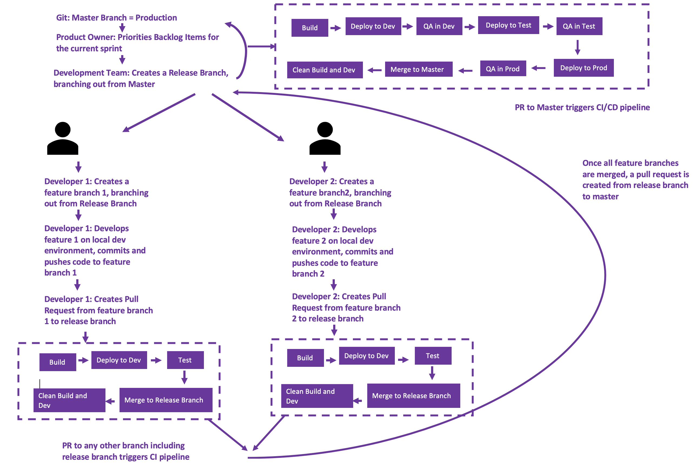

---
layout: default
grand_parent: Product Approach
parent: Adopting DevOps
title: Journey of a Change Through DevOps
nav_order: 2
--- 

# Journey of a Change Through DevOps

A typical process for making a new change would a shown below:
 

Note:

 - This is one of the few best practices followed
 - The CI pipeline and CI/CD pipeline are not 2 pipelines, it is not good practice to run 2 pipelines from a given repo. The CI pipeline in the same CI/CD pipeline which works differently when the Pull Request is made to a master branch and any other branch.
 - This flow follows a git flow, where the release branch is merged once the change is in production.
 - The pipeline can be run using any orchestrator like Jenkins or Circle CI or Gitlab CI etc.
 - It is considered good practice that the build and deploy should be done within the pipeline using a single commandline which would also work from the developers local machine.
 - Adding manual gates or approval stages in the pipeline would make it Continuous Delivery and a completely automated pipeline is Continuous Deployment. Continuous Delivery is a slow and steady path to move towards the Continuous Deployment Model.

 

