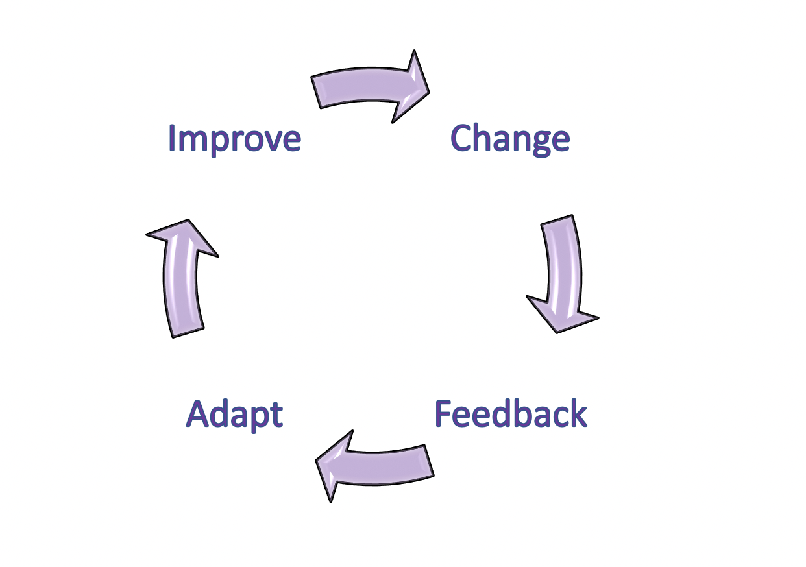

=======
title: What is Domain Driven Design?
parent: Domain Driven Design
grand_parent: Modernization Playbook  
nav_order: 1
---

# What is Domain Driven Design?
   
  

  Take a look around you. That park was carefully modelled and designed before it was built, and so was every road, every street and even this city. There is a lot of thought given while planning and designing automotives, aircrafts, bridges and buildings. Why not design and model software? If you think software design is expensive, fixing a bad design is even more expensive.

  Some of the ill effects of not giving enough thought to design include:

  - broken, slow, locking database queries
  - wrong abstractions in the code
  - strongly coupled services that might lead to broken processes, unreconciled data and systems that are impossible to maintain 
  - a rift between the mental model that the business owns and the software that is developed and delivered
                                         

## What is Domain Driven Design?
   
  

 Domain Driven Design has the following characterstics:
 
  - It helps to **model** your application so that there is a one-to-one relation between your source code and structure of the business domain, and when there is a change made to the business domain, it directly maps to the change is souce code
  - It is a **collaborative** exercise between the Business and the developers on a daily basis
  - The model is built to solve current architectural problems and **incrementally** evolves over time.
  
  There is a two way relation between your business domain and your system. Every time you make a change to your business domain, it influences the system code. The end users make use of the system and their usage influences your domain to change.

###  How does Domain Driven Design fit with Agile?

  Domain Driven Design cannot be done with being agile. It requires constant collaboration between the Business and the developers and the Business would contribute significantly towards the design of the code since there is a one to one relationship between the structure of the Domain and structure of the code.

  Agile is based on the Inspect and Adapt Loop.

  

  Domain Driven Design is exactly in line with Agile Principles and is all about ensuring that your user stories are delivered incrementally.

  

>>>>>>> Removed leading "C." from "Modernization Playbook"
