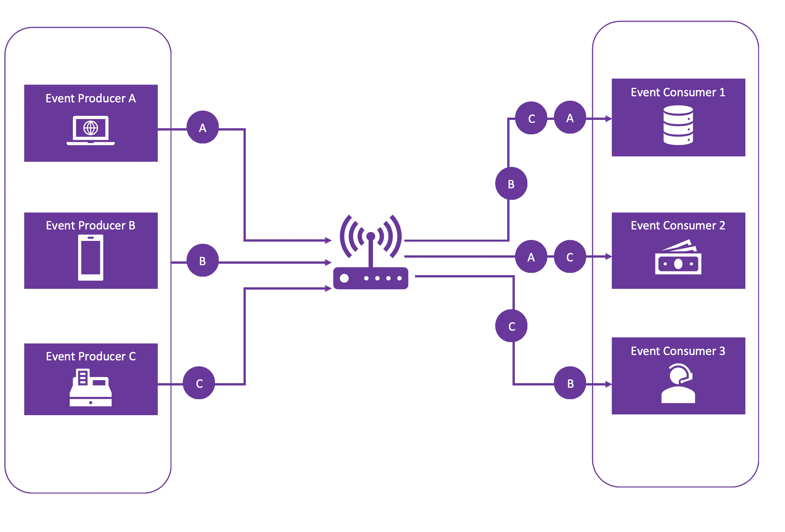

# Types of Event Driven Systems

## Reactive Systems

Reactive systems follow a publisher-subscriber model , where the event producer or publisher generates an event which triggers the event subscribers or consumers and the publishers are totally unaware of who the subscribers are.

For example, in the above diagram, if we are talking about a hotel booking system for a given popular hotel in the peak of summer:

- **Event A** is to cancel a booking
- **Event B** is to query if there is an availability
- **Event C** is to book a new room

 
- *Event Consumer 1* is the hotel database
- *Event Consumer 2* is the booking and payment system
- *Event Consumer 3* is customer service

Then,

  The event router would ingest, filter and route requests in the following way:

  *Event Consumer 1* would recieve the cancellation event first (**A**), new booking next (**C**) and the query (**B**) third in order. All three events require access to the database, so Event Consumer 1 will be triggered by all events.

  *Event Consumer 2* would recieve the new order first (**C**) and then the cancellation(**A**). Note that this consumer will not be triggered by **event B**, since the booking and payment service need not be called when the user is just querying for availability. 

  *Event Consumer 3*, that is the customer service will be triggered to answer to the query(**B**) and then respond to the new order(**C**).

## Stream Processing Systems

  Stream processing systems use events in a more intensive, data-oriented manner. This is a pattern normally found in IoT systems. They are also used by Social Media Networks to perform real-time data analytics as well as by Cloud Service Providers for Fraud Detection.

  For example, the system that counts the number of views on the a video in Youtube. The service would collect all the events in a set time window  and the stream processor would then calculate the statistical variance of the data and display this data.

