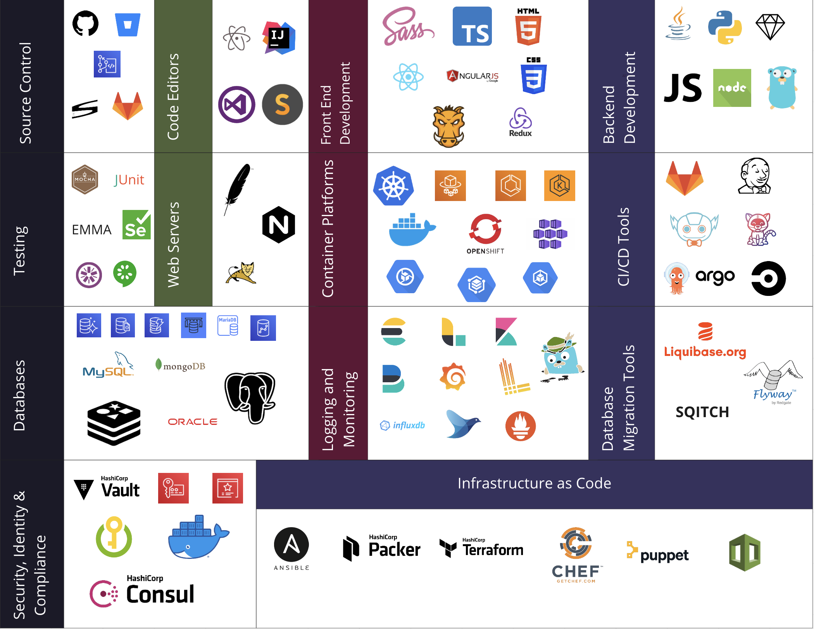

# Modern Web Application Components
 

# Also Read

[Source Control](SourceControlSystems.html)

[Code Editors](CodeEditors.html)

[Frontend Development Tools](FrontendDevTools.html)

[Backend Development Tools](BackendDevTools.html)

[Testing Tools and Frameworks](Testing.html)

[Web Services](WebServices.html)

[Container Platforms](ContainerPlatforms.html)

[CI/CD Tools](CI-CD.html)

[Databases](Databases.html)

[Logging & Monitoring Tools](Logging&Monitoring.html)

[Database Migration Tools](DatabaseMigrationTools.html)

[Security, Identity & Compliance](Security.md)

# Image Credits
* Selenium - Diego Molina (diemol) / CC BY-SA (https://  creativecommons.org/licenses/by-sa/4.0))

* Tekton, ArgoCD, Prometheus, Loki, Jaegar  - http://branding.cncf.io

* Github, Atom, IntelliJ, VSCode, Sass, React, Redux, Kubernetes, GoLang, Mocha, Jasmine, Cucumber, Openshift, JenkinsX, Oracle, InfluxDB, Fluentd, Ansible, Chef, Puppet - (Public Domain License)- free to use

* Bitbucket, Subversion, GitLab, SublimeText, Java, Python, Ruby, JavaScript, Nodejs,  Apache, Nginx, Docker, Jenkins, MySQL, MongoDB, PostgreSQL, Redis, - https://www.iconfinder.com/ (Creative Commons License 3.0, https://  creativecommons.org/licenses/by-sa/3.0))

* AWS icons - https://aws.amazon.com/architecture/icons/

* Typescript - Microsoft / CC BY (https://creativecommons.org/licenses/by/4.0)

* HTML5 - HTML5-logo.svg: W3Cderivative work: Patio / CC BY (https://creativecommons.org/licenses/by/3.0)

* Angular - AngularJS / CC BY-SA (https://creativecommons.org/licenses/by-sa/3.0)

* CSS - Rudloff / CC BY (https://creativecommons.org/licenses/by/3.0)

* Grunt - Carolinedmoreschi / CC BY-SA (https://creativecommons.org/licenses/by-sa/4.0)

* Tomcat - Apache Software Foundation (ASF) / Apache License 2.0 (http://www.apache.org/licenses/LICENSE-2.0)

* CircleCI - FelicianoTech / CC BY-SA (https://creativecommons.org/licenses/by-sa/4.0)

* ElasticSearch, LogStash, Kibana, Beats - https://www.elastic.co/brand

* Liquibase Community - https://www.liquibase.org/wp-content/uploads/sites/6/2020/05/Liquibase_community_logo_vertical_RGB.svg

* Flyway DB - Redgate / CC BY-SA (https://creativecommons.org/licenses/by-sa/4.0)

* Hashicorp Icons - https://www.hashicorp.com/brand/