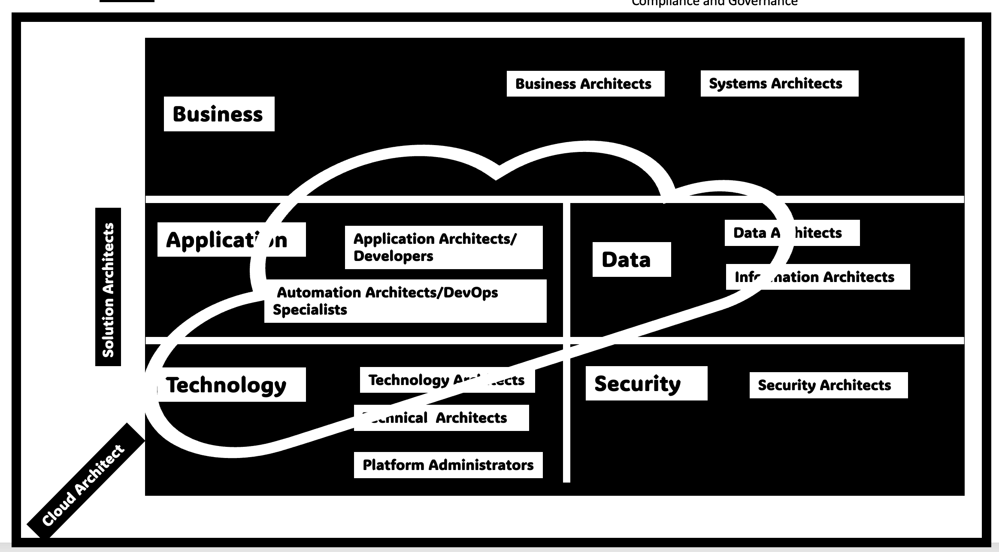

# BC Government IT Architectural Blog

## Introduction 

This blog is a collection of documents which is a living guide to IT architecture within the Government of British Columbia. This repository of documents is maintained by the OCIO Enterprise Architecture and created incollaboration with architects from ministries across BC Gov. These guidelines will help you with architectural decision making for developing and maintaining compliant, highly available, and resilient products in both private and public cloud. 

## Enterprise Architecture

Information Technology Architecture is the structural design and behaviour of multiple components and subsystems within an organization. It is composed of various distinct practices and it is important to note that there are various architectural functions within BC Gov. Each architect's role is different. Here, we capture the role of a centralized and distributed Enterprise Architecture function as well as distinguish the Enterprise Architect from other types of Architects.

In order to first understand the role of architects, Let us first take a look at BC Gov as an enterprise. BC Gov has 23 ministries, 12 central agencies, 29 crown corporations and 34 independent boards and tribunals each of whom cater to their respective end users using evolving technology which needs to be regulated with governance, standards, policies and compliance. The BC Government is a complex enterprise composed off several other enterprises. 

Each enterprise is further defined by its business, data, applications, technology and security. Each employee(full time or part time or contractor) plays a role in one or more of these 5 layers. Focusing just on the architects, there are 14 different types of architects or roles that perform similar functions within BC Gov.

1. Technical Architects                 2. Technology Architects                    3. System Architects
4. Security Architects                  5. Application Architects                   6. DevOps Specialists
7. Full Stack Developers                8. Data Architects                          9. Information Architects
9. Cloud Architects                    10. Solution Architects                      11. Business Architects
12. Enterprise Architects

The diagram below represents the different types of architects and their interation with the various layers. 

The Enterprise Architecture function within each function helps to understand and build cohesion between the various other roles and layers in the enterprise. Besides enterprise architectural units that may exist within each enterprise, BC Gov also has a central architectural team from the Office of the Chief Information Officer (OCIO) who are responsible to help foster the enterprise architectural teams within each enterprise as well as break the siloes between various enterprises within BC Gov to promote collaborative use of technology and adopt reusable technology where possible to reduce costs.

The four pillars of the central EA function are:

