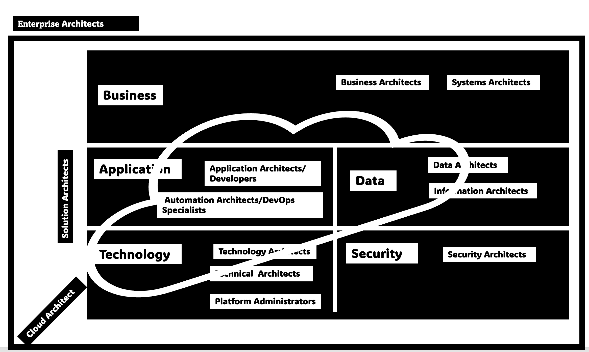

# B.C. Government Information Technology Architectural Guidance

## Introduction 

The Office of the Chief Information Officer (OCIO)'s Enterprise Architecture team creates architectural practices for ministries across government product teams. Our goal is to make sure we collaborate and develop digital products that are cross-platform compatible, resilient and cost effective across B.C. Government. We deliver by adopting standardized development as well as architectural practices. The outcome we strive for is human-centric digital services for B.C. residents. 

Our repository and documents were co-created with B.C. Government Architects.

If you have any questions, concerns or feedback for [work in progress](#ea-work-in-progress), please contact us as [CITZAS@gov.bc.ca](mailto:CITZAS@gov.bc.ca).

## Enterprise Architecture (EA)

The diagram below represents the different types of architects and their interation with the various layers. [Mermaid diagram?]

The Enterprise Architecture function within each function helps to understand and build cohesion between the various other roles and layers in the enterprise. Besides enterprise architectural units that may exist within each enterprise, BC Gov also has a central architectural team from the Office of the Chief Information Officer (OCIO) who are responsible to help foster the enterprise architectural teams within each enterprise as well as break the siloes between various enterprises within BC Gov to promote collaborative use of technology and adopt reusable technology where possible to reduce costs.

The four pillars of the central EA function are:

**Please note**: The Enterprise Architecture team isn't create and maintain governance for Artificial Intelligence.  

### Enterprise Architects and Architects

Information Technology Architecture is the structural design and behaviour of multiple components and subsystems in an organization. It uses various distinct practices. 

Across government, we have numerous architectural roles, all of whom have different functions. Our team, Enterprise Architecture, is the centralized for B.C. Government. We help interweave architectural practices into other ministries and agencies across government by building a community of de-centralized enterprise architecture units, other architects, and product teams.

To comprehend the diversity of architects, let's look at government as an enterprise. We have: 

* 23 Ministries
* 12 Central Agencies
* 29 Crown Corporations
* 34 Independent Boards and tribunals

All entities use adaptive technology and needs regulation via governance, standards, and policies. Each entity is further defined by its business, data, applications, technology and security. 

Focusing on the architects, there are 13 different roles:

* Technical Architects
* Technology Architects
* System Architects
* Security Architects
* Application Architects
* DevOps Specialists
* Full Stack Developers
* Data Architects
* Information Architects
* Cloud Architects
* Solution Architects
* Business Architects
* Enterprise Architects.

## EA Work in Progress

1. [A Service/Product Catalog for Private and Public Cloud Services (IDIR Protected)](https://bcgov.sharepoint.com/:x:/r/teams/08374/Shared%20Documents/General/bcgov_product_catalog.xlsx?d=w4ba2a72f36f645629208db5f474795c2&csf=1&web=1&e=o4HiFl) 
2. [Reliability Trade Off and Patterns as well as RPO-RTO Matric (IDIR Protected)](https://bcgov.sharepoint.com/:x:/r/teams/08374/Shared%20Documents/General/rpo-rto-matrix.xlsx?d=w3875a6489a3b4e60b4c2588047897efd&csf=1&web=1&e=zeo0xW)
3. [Resilience vs Availability Decision Swim Lane](https://github.com/bcgov/architect-for-bcgov/blob/main/pictures/Chaos-FlowChart.jpg)
